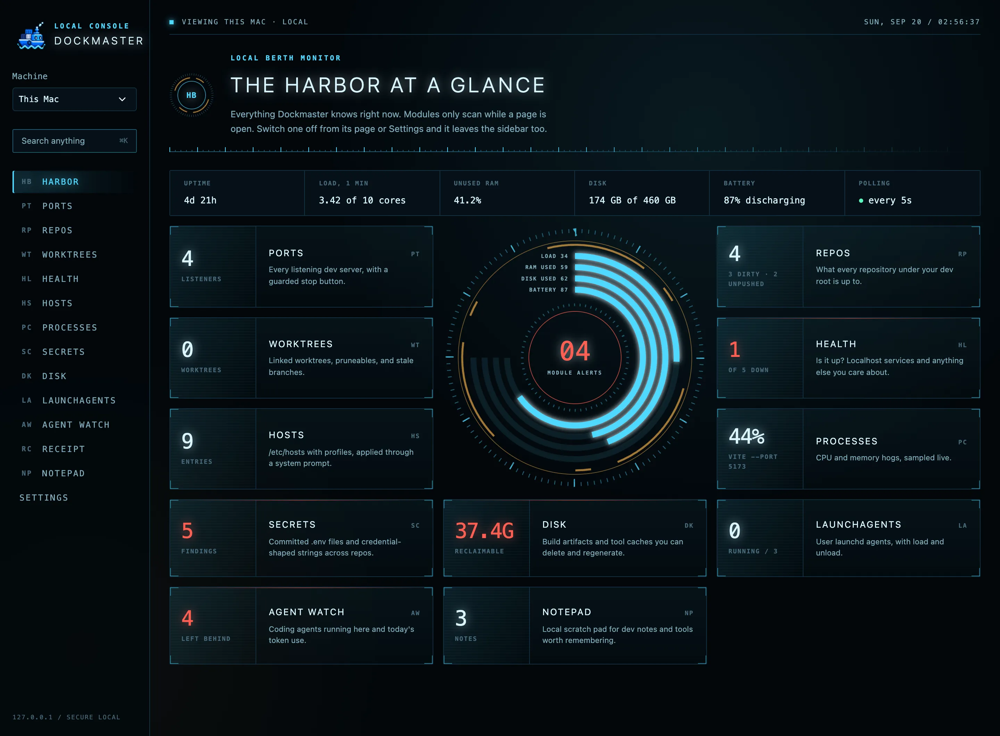
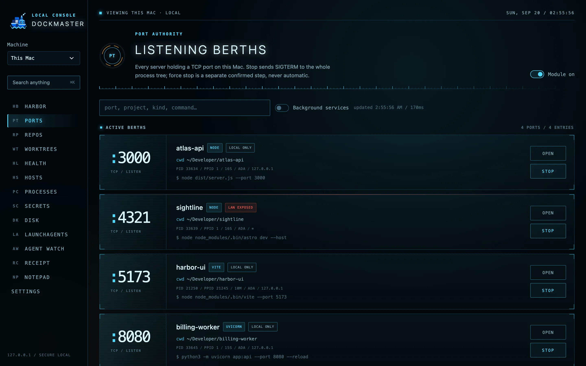
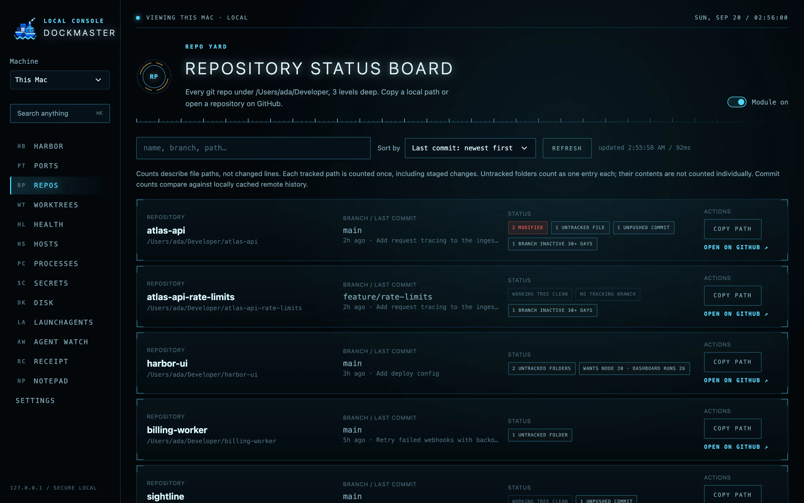
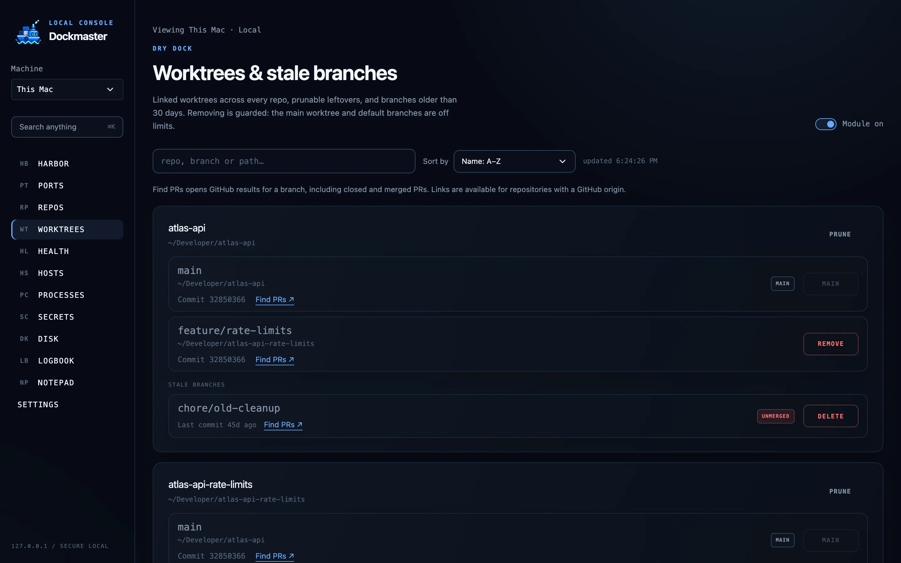
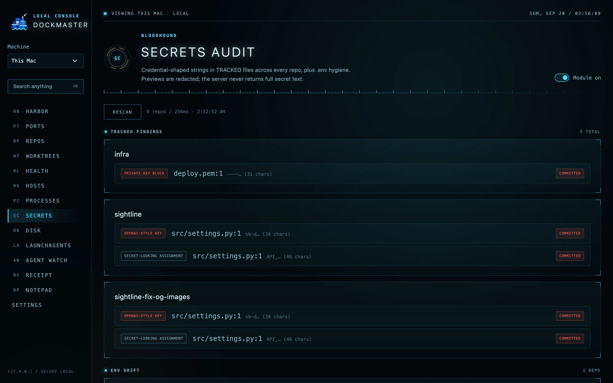
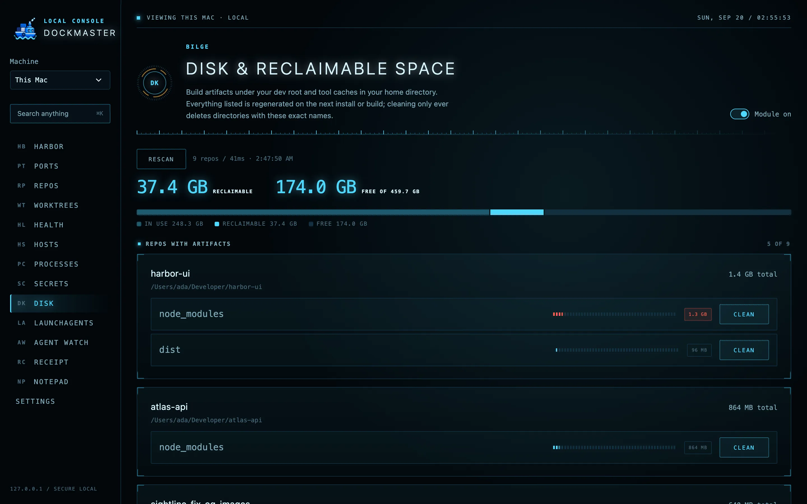
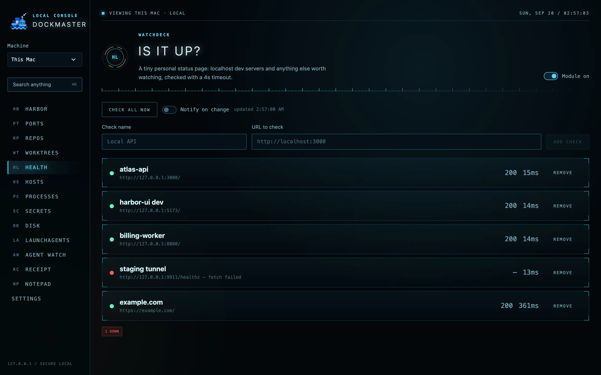

# Dockmaster

**Know what’s running on your Mac and your homelab.**

macOS only · Node 20.12+ · MIT · [trydockmaster.vercel.app](https://trydockmaster.vercel.app)

Find stray dev servers, inspect repos and worktrees, and check system health from one local dashboard.

Dockmaster grew out of [Port Authority](legacy/port_authority.py) — the single-file port
dashboard now lives in `legacy/` for reference. The idea scaled: a dev tool should know
what's on your machine, and it should be able to _safely_ act on it.

**view images at the end of the README**

## Setup

The easiest way to set up Dockmaster is to ask your coding agent. Copy this prompt:

```text
Set up Dockmaster on this Mac: https://github.com/naman0r/dockmaster

Clone the repo or use an existing checkout, read the README, and check the
requirements. Install dependencies, configure my development root, build and
start the production app on loopback, and verify it works. Give me the URL
and explain how to start and stop it. If I want to connect a homelab, follow
docs/remote-machines.md using my existing SSH access.
```

Prefer doing it yourself? See [Run it](#run-it) below.

## Modules

| Module        | What it does                                                                                                                                                                                                                                                              |
| ------------- | ------------------------------------------------------------------------------------------------------------------------------------------------------------------------------------------------------------------------------------------------------------------------- |
| **Harbor**    | Landing overview: one live card per module plus a system vitals strip (uptime, load, memory, disk, battery).                                                                                                                                                              |
| **Ports**     | Every listening dev server (lsof/ps), with a guarded stop button. Full Port Authority behavior: tree-kill, SIGTERM-then-confirmed-SIGKILL, PID-reuse protection, LAN-exposure badges.                                                                                     |
| **Repos**     | Status board for every git repo under your dev root: dirty files, ahead/behind, stale branches, last commit.                                                                                                                                                              |
| **Worktrees** | Linked worktrees and branches older than 30 days. Remove worktrees, prune, delete branches — main worktree and default branches are off limits.                                                                                                                           |
| **Health**    | "Is it up?" — a personal status page for localhost services and external URLs, with status code and latency.                                                                                                                                                              |
| **Hosts**     | /etc/hosts viewer with profiles. Applying opens the macOS admin prompt (no sudoers edits), always backs up first, flushes the DNS cache.                                                                                                                                  |
| **Processes** | Instantaneous CPU (two ps samples, one second apart) and memory. Stop is guarded like Ports: own processes only, never PID 1 or Dockmaster's ancestors.                                                                                                                   |
| **Secrets**   | Credential-shaped strings in _tracked_ files across all repos (AWS/Slack/GitHub/Google/OpenAI keys, private key blocks, generic assignments). Previews are redacted server-side; the API never returns full secret text. Also lists untracked .env files (the good kind) and keys your .env.example declares that .env does not set. |
| **Containers** | Every container the Docker daemon knows about (Docker Desktop or OrbStack), with compose project, image, ports, and a stop that re-verifies the container id before asking the daemon for a graceful shutdown. Nothing is removed. |
| **Disk**      | Reclaimable space: node_modules, build output, virtualenvs and similar under every repo, plus tool caches in your home directory (Xcode DerivedData, Homebrew, npm, pnpm, pip, Cargo, Go). Sizes come from `du`. Clean only ever deletes a directory whose exact name is on the artifact list or whose path is a known cache; symlinks are refused.                                                   |
| **Logbook**   | "Which project had you today" — samples the frontmost app via osascript. Fully demand-driven: it records only while the page is open and visible. Window titles are never stored.                                                                                         |
| **Notepad**   | Local scratch pad: timestamped dev notes (tools you found, snippets, ideas) stored in `~/.dockmaster/notes.json`.                                                                                                                                                         |

Every scanning module can be switched off from its own page (persisted in `~/.dockmaster/settings.json`).

## Repository and worktree shortcuts

Repository rows break down modified, added, deleted, renamed, copied, conflicted,
and untracked paths. Each tracked path is counted once, even if both staged and
unstaged; untracked files and grouped folders have separate counts. These are
path counts, not diff lines. Copy a repository path or open its GitHub origin
from the row actions.

Repositories default to newest commit first. The **Sort by** menu also offers
oldest commit, name in either direction, tracked changes, untracked entries,
unpushed commits, and commits behind the remote. The browser remembers your
choice. Sorting uses existing scan data and makes no additional requests.

Worktrees show their commit ID and any prune reason. **Find PRs** opens GitHub's
branch-filtered PR search, including closed and merged PRs; it does not assert
that a PR exists or fetch live PR status. These links use the local `origin`
configuration with no GitHub API requests, credentials, or background polling.
Repositories without a recognized GitHub origin keep their local actions.

## Quick navigation

Press **⌘K** (or **Ctrl+K**) anywhere, or click **Search anything** in the sidebar.
Jump to a module, or search project names, branches, paths, ports, commands, and
note text. Use **↑ / ↓** and **Enter** to open a result; **Esc** closes the palette.
Project, port, and note results jump to and highlight their matching row.
Search data loads only when the palette opens and respects disabled modules.

## Resource discipline

Nothing scans unless someone is looking:

- All discovery is demand-driven with a short TTL cache and request coalescing.
- Frontend polling pauses when the tab is hidden (`visibilitychange`).
- The Logbook heartbeat only runs while its page is open and tracking is on; there is
  no background timer anywhere in the server.
- Bulk git scans run with bounded concurrency (4-6 processes).

A running Dockmaster idles near zero; the Next.js server itself is the main resident cost.

## Run it

Requirements: macOS, Node 20.12+.

```bash
npm install
cp .env.example .env   # optional: every value has a default
```

Dockmaster has two modes. Use production unless you are changing its code.

### Production

```bash
npm run build
npm start              # http://localhost:36252
```

`build` compiles once into `.next`; `start` serves that bundle. This is the always-on
mode: roughly 150-200 MB resident, no CPU while no tab is open, and every page renders
in a few milliseconds. The server keeps serving the old bundle after you pull changes,
so rebuild and restart to pick them up.

### Development

```bash
npm run dev            # same port
```

`dev` compiles each page the first time it is opened, watches every file, and keeps the
bundler resident: expect 500 MB or more and a one to three second pause on the first
visit to each page. Use it only while editing Dockmaster. Leaving it running for days is
the most common reason the dashboard feels slow.

Both modes share `.env`, the data dir, and the port, so stop one before starting the
other. To see which one is running:

```bash
ps -axo pid,etime,command | grep -E "serve.mjs (dev|start)" | grep -v grep
```

### Configuration (.env)

| Variable                         | Default         | Meaning                                                                                                                                                       |
| -------------------------------- | --------------- | ------------------------------------------------------------------------------------------------------------------------------------------------------------- |
| `DOCKMASTER_PORT`                | `36252`         | Loopback listen port. Deliberately obscure so a 24/7 instance never fights a dev server for 3000. Applies to `npm run dev`, `npm start`, and the LaunchAgent. |
| `DOCKMASTER_DATA_DIR`            | `~/.dockmaster` | Settings, profiles, logbook, backups                                                                                                                          |
| `DOCKMASTER_DEV_ROOT`            | `~/Developer`   | Where the repo scanner walks                                                                                                                                  |
| `DOCKMASTER_WALK_DEPTH`          | `3`             | Repo scan depth                                                                                                                                               |
| `DOCKMASTER_LOGBOOK_INTERVAL_MS` | `10000`         | Logbook sample interval                                                                                                                                       |

No private information is hardcoded; everything comes from the environment or your
local data dir.

## Keep it running

Install a per-user LaunchAgent. It runs the production server, so build first:

```bash
npm run build
npm run agent:install     # com.dockmaster.app, starts at login
npm run agent:uninstall
```

Logs land in `~/.dockmaster/logs/`. Run both commands again after pulling changes;
`agent:install` replaces and restarts the agent. The plist records the absolute path of
the `node` that ran the install, so also re-run it after upgrading Node with nvm or mise.
Otherwise launchd retries a missing binary every ten seconds.

## Security model

The dashboard can kill processes and rewrite /etc/hosts, so it defends itself the way
Port Authority did:

1. Binds to `127.0.0.1` only; middleware rejects any non-loopback `Host` header (DNS
   rebinding).
2. API requests require a per-process token injected into the page; a custom header
   forces a CORS preflight, which is answered without CORS headers so the browser
   blocks the real request. A missing or stale token is a 401; action refusals are 403.
3. `Origin` is validated on every API request.
4. Destructive actions re-verify identity against a fresh scan (stale rows 409), and
   the process-tree kill refuses PID 1, Dockmaster itself, its ancestors, and any
   process owned by another user.

## Development

```bash
npm run typecheck
npm test        # vitest — parsers and safety guards
```

Contributions are welcome. [CONTRIBUTING.md](CONTRIBUTING.md) has the module recipe; [AGENTS.md](AGENTS.md) has the architecture notes and the invariants every change must keep.


---

<p>







</p>


## Remote machines

Settings → Machines connects another Mac over SSH. Harbor, Ports, Repos, Worktrees, Processes, Health, Hosts, Secrets, and Disk support remote collection; guarded actions and loopback forwarding are available. Hosts application requires an optional explicitly installed privileged helper. Notepad stays shared and Logbook stays local-only. See [installation, operation, and validation notes](docs/remote-machines.md).
